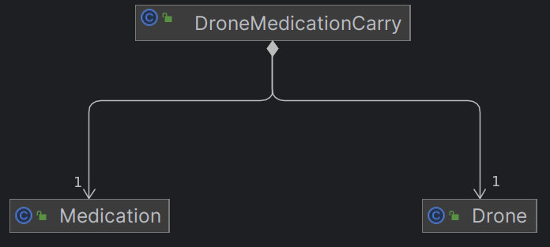

# Drone Management Microservice

Purpose of this microservice is to handle drone basic actions and features such carrying small weights like medicines
from a point to another.

### *This microservice uses 5 basic technologies to meet the requirements*

# ⚡ Backend

As we can see Spring Boot 3.2.4 over Spring 6 is used to deliver the server-side logic and handling the business
requirements.

# 📦 Build Tool

Maven is chosen for its great community support and the most used build tool for Java/Spring application.

# 🐘 Database

SQL Database is Chosen for its Solidity and Structural Architecture, and Postgres is seen currently as the most powerful
Database Engine.

# ✉️⛓️ Message Broker

Kafka is known for its Core Capabilities as High Throughput, Scalable, High Availability Message Broker Technology used
for the _**Logging usecase**_.

# 🐳🚢 Containerization

Docker is used for its wide image repository that almost contain every application, also Docker Compose is used for
running multi-container application as per we are using Postgres and Kafka.

## 📋 Requirements

* ☕ Java 17+
* 🐳 Docker 23.0.0+
* <span style="color:lightblue">_M_</span> Maven 3.9.5

## Instructions to build the project

### Docker installation is a must, so please refer to [Docker Instruction Guide](documentations/Docker-Instructions.md) if not.

Just as simple as

```shell
./mvnw spring-boot:run
```

## Database Relationships

As mentioned above Database type used is SQL below is a simple ER-Diagram

Our Two main entities are Drone and Medication with Many-To-Many relationship composed to two One-To-Many relationships
with a DroneMedicationCarry composer.



### DroneMedicationCarry has some merging fields that are below:

* Pickup Location (The Location where the drone change its state to be Delivering)
* Destination Location (The Location where the drone change its state to be Delivered)
* Start Date (The time the Drone changed its state to be Delivering)
* End Date (The time the Drone changed its state to be Delivered)

# [API Documentation](documentations/API-Documentation.md)
